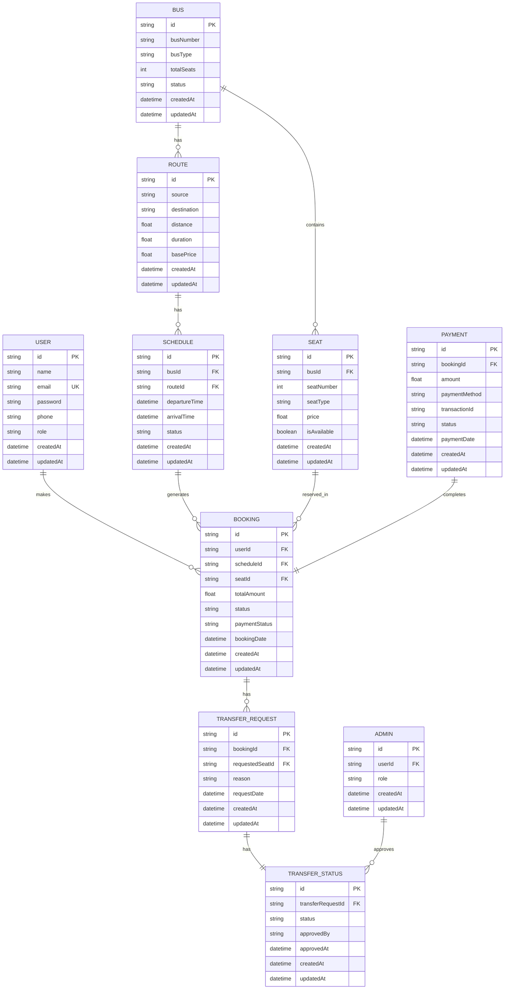

# Bus Booking System - ER Diagram

## Entity Descriptions

### 1. User
- Primary entity for user management
- Stores user authentication and profile information
- Has role-based access control (user/admin)

### 2. Bus
- Represents physical bus information
- Contains basic bus details and status
- Linked to routes and seats

### 3. Route
- Defines bus routes between locations
- Contains pricing and distance information
- Linked to schedules and buses

### 4. Schedule
- Manages bus departure and arrival times
- Links buses to routes
- Generates bookings

### 5. Seat
- Represents individual seats in a bus
- Contains seat type and pricing information
- Tracks seat availability

### 6. Booking
- Core entity for ticket booking
- Links users, schedules, and seats
- Tracks payment and booking status

### 7. Transfer Request
- Manages seat transfer requests
- Links to original booking
- Contains transfer reason

### 8. Transfer Status
- Tracks status of transfer requests
- Records admin approval information
- One-to-one relationship with transfer requests

### 9. Payment
- Handles payment information
- Links to bookings
- Tracks transaction status

### 10. Admin
- Manages administrative users
- Handles transfer approvals
- Links to user entity

## Relationships

1. **User - Booking**: One-to-Many
   - A user can have multiple bookings
   - Each booking belongs to one user

2. **Bus - Route**: One-to-Many
   - A bus can be assigned to multiple routes
   - Each route can have multiple buses

3. **Bus - Seat**: One-to-Many
   - A bus contains multiple seats
   - Each seat belongs to one bus

4. **Route - Schedule**: One-to-Many
   - A route can have multiple schedules
   - Each schedule belongs to one route

5. **Schedule - Booking**: One-to-Many
   - A schedule can generate multiple bookings
   - Each booking belongs to one schedule

6. **Seat - Booking**: One-to-Many
   - A seat can be booked multiple times
   - Each booking is for one seat

7. **Booking - Transfer Request**: One-to-Many
   - A booking can have multiple transfer requests
   - Each transfer request belongs to one booking

8. **Transfer Request - Transfer Status**: One-to-One
   - Each transfer request has one status
   - Each status belongs to one transfer request

9. **Booking - Payment**: One-to-One
   - Each booking has one payment
   - Each payment belongs to one booking

10. **Admin - Transfer Status**: One-to-Many
    - An admin can approve multiple transfers
    - Each transfer status is approved by one admin

## Notes:
1. All entities include createdAt and updatedAt timestamps
2. Foreign keys are denoted with FK suffix
3. Primary keys are denoted with PK suffix
4. Unique constraints are denoted with UK suffix
5. Relationships are enforced through foreign key constraints 